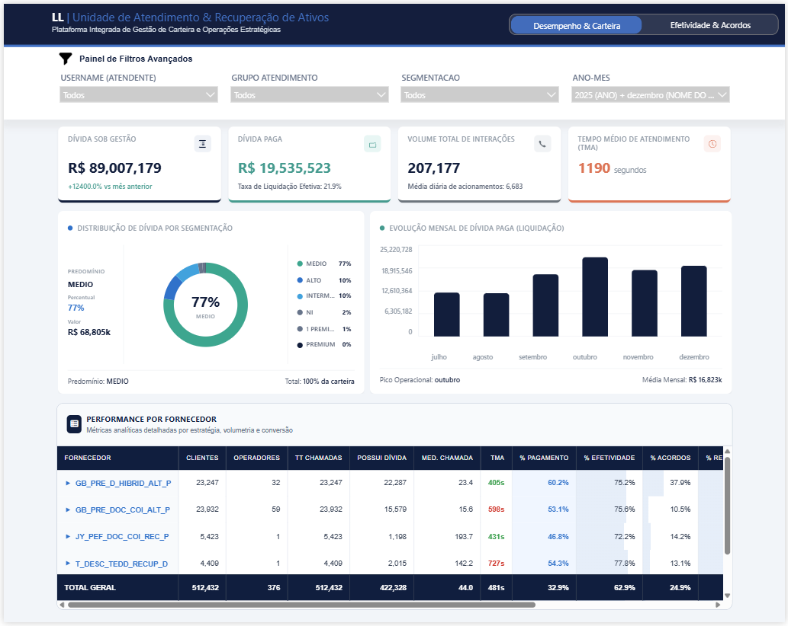

# Analytics Recovery Platform



Plataforma analítica desenvolvida para consolidação, tratamento e visualização de indicadores operacionais e financeiros relacionados à gestão de carteiras, negociações e performance operacional.

O projeto contempla todo o fluxo analítico, desde a preparação e transformação dos dados em SAS Studio até a construção da camada de consumo e visualização em Power BI.

## Objetivo

Transformar dados operacionais brutos em informações estruturadas para suporte à tomada de decisão, permitindo acompanhar indicadores de produtividade, efetividade operacional, negociações realizadas, comportamento da carteira e evolução dos resultados ao longo do tempo.

## Escopo do Projeto

O projeto foi desenvolvido de ponta a ponta, contemplando:

* Tratamento de dados operacionais;
* Consolidação de múltiplas fontes de informação;
* Aplicação de regras de negócio;
* Construção de métricas derivadas;
* Modelagem analítica;
* Criação de indicadores operacionais e financeiros;
* Estruturação da camada de consumo para Power BI;
* Desenvolvimento dos dashboards finais.

## Principais Funcionalidades

### Gestão de Carteira

Permite acompanhar a evolução da carteira ao longo do tempo, incluindo distribuição de clientes, comportamento operacional e indicadores financeiros.

### Monitoramento de Performance

Disponibiliza indicadores de produtividade, volume operacional, tempo médio de atendimento, conversão e eficiência operacional.

### Análise de Negociações

Permite acompanhar negociações realizadas, negociações rompidas e indicadores relacionados à efetividade operacional.

### Indicadores Financeiros

Apresenta métricas relacionadas à evolução dos valores negociados e análises comparativas entre diferentes períodos e segmentos.

### Segmentação Analítica

Possibilita análises por diferentes dimensões operacionais, permitindo avaliações comparativas entre grupos, categorias e períodos.

## Tecnologias Utilizadas

### Processamento e Transformação

* SAS Studio
* PROC SQL
* DATA STEP

### Modelagem e Consumo

* Power BI
* DAX
* Power Query (M)

### Conceitos Aplicados

* ETL / ELT
* Data Transformation
* Data Modeling
* Analytics Engineering
* Data Quality
* KPI Management
* Business Rules Implementation

## Dashboards Desenvolvidos

O projeto inclui dashboards voltados para:

* Acompanhamento operacional;
* Evolução da carteira;
* Performance de negociações;
* Indicadores financeiros;
* Monitoramento de produtividade;
* Análises gerenciais e executivas.

## Estrutura do Repositório

```text
analytics-recovery-platform/

├── README.md

├── sas/
│   ├── RECEPTIVO macro.sas
│   └── RECEPTIVO Table.sas

├── dashboard/
│   └── Atendimento & Recuperação.pbix

├── screenshots/
│   ├── overview/
│   │   ├── Page1_Desempenho_&_Carteira_Pt1.png
│   │   └── Page2_Efetividade_&_Acordos_Pt1.png
│   │
│   ├── PG1 KPI Cards/
│   │   ├── Page1__Desempenho_&_Carteira_KPI_Effect_1.png
│   │   ├── Page1__Desempenho_&_Carteira_KPI_Effect_2.png
│   │   └── Page1__Desempenho_&_Carteira_KPI_Effect_3.png
│   │   └── Page1__Desempenho_&_Carteira_KPI_Effect_4.png
│   │
│   ├── PG1 KPI Bars/
│   │   ├── Page1_Desempenho_&_Carteira_KPI_Effect_Barra_1.png
│   │   └── Page1_Desempenho_&_Carteira_KPI_Effect_Barra_2.png
│   │
│   ├── PG1 KPI Rosca/
│   │   ├── Page1_Desempenho_&_Carteira_KPI_Effect_Rosca_1.png
│   │   └── Page1_Desempenho_&_Carteira_KPI_Effect_Rosca_2.png
│   │
│   ├── PG2 KPI Bars/
│   │   ├── Page2_Efetividade_&_Acordos_Effect_Barra_1.png
│   │   └── Page2_Efetividade_&_Acordos_Effect_Barra_2.png
│   │   └── Page2_Efetividade_&_Acordos_Effect_Barra_3.png
```

## Resultados

A solução centraliza informações operacionais em uma única camada analítica, permitindo análises consistentes, redução de consolidações manuais e maior rastreabilidade dos indicadores utilizados para acompanhamento e tomada de decisão.
